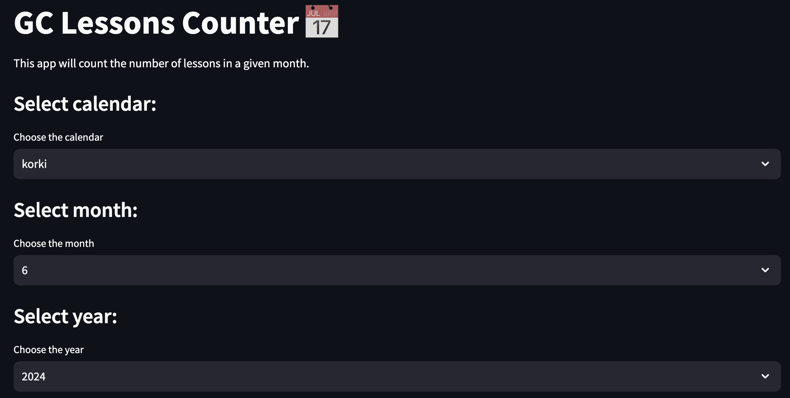

# Lessons Counter for Google Calendar




## Instalattion

```bash
pip install -r requirements.txt
```

## Usage

1. Add 'credentials.json' file in the root directory

2. ```bash
    streamlit run Lessons_Counter.py
    ```
3. Open the link in the browser
